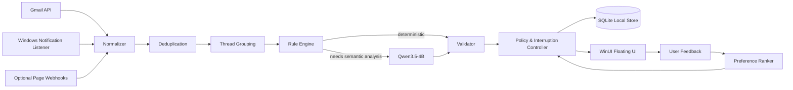

# SignalDesk Agent：完整產品與技術設計

## 0. 文件目的

本文件定義 SignalDesk 從產品概念、Agent 行為、Connector、模型、資料、訓練、UI、驗證到部署的完整設計。

SignalDesk 的核心不是「用 LLM 產生摘要」，而是：

> **在使用者工作期間，持續接收不同訊息來源，維護事件與對話狀態，判斷哪些資訊值得打斷使用者，擷取需要處理的工作，並透過可追溯的桌面卡片提供下一步。**

本設計刻意不納入 FAD 與 Adaptive Exit。它們可作為日後獨立研究，但不是本產品 v1 的成功條件。

---

# 1. 產品定義

## 1.1 名稱

**SignalDesk Agent**

副標：

> A local-first unified inbox agent for focused desktop work.

中文定位：

> 本地優先的桌面訊息重點、待辦與回覆助手。

## 1.2 使用者問題

現代使用者同時面對：

- Gmail 完整郵件；
- LINE 新訊息；
- Facebook Messenger 新訊息；
- 系統通知；
- GitHub、日曆、會議等通知。

問題不是「看不到通知」，而是：

1. 所有通知都以相同方式打斷使用者。
2. 相同對話的多則短訊息被拆成多次干擾。
3. 使用者需要自己判斷哪一則要回覆。
4. 期限與待辦容易埋在文字中。
5. Gmail、LINE、Messenger 分散在不同 App。
6. 一般通知中心不理解對方真正要求了什麼。
7. 雲端 AI 可能需要上傳私人訊息。

## 1.3 產品價值

SignalDesk 將「訊息」轉換為「可執行資訊」：

```text
教授：今晚前請把實驗結果寄給我
↓
高優先
需要回覆
待辦：整理並寄出實驗結果
期限：今晚
操作：[開啟 Gmail] [產生草稿] [建立提醒]
```

## 1.4 主要使用者

- 研究生與工程師；
- 同時使用 Gmail、LINE、Messenger 的 Windows 使用者；
- 需要保護私人訊息的人；
- 希望降低工作中斷，但不能漏掉重要訊息的人。

---

# 2. 產品核心場景

## 2.1 Gmail 工作郵件

來源內容完整，Agent 可做：

- thread 摘要；
- 是否需要回覆；
- 待辦與期限；
- 回覆草稿；
- 開啟 Gmail；
- 建立本地提醒。

## 2.2 LINE／Messenger 通知預覽

來源只有通知預覽，Agent 可做：

- 短時間內同一 sender/group 分群；
- 預覽摘要；
- 是否可能需要回覆；
- 建議開啟來源；
- 建立提醒；
- 顯示「上下文不完整」。

Agent 不得聲稱讀取完整聊天記錄。

## 2.3 每日 Digest

固定時間顯示：

```text
需要立即處理：2
今天到期：3
等待你回覆：4
僅供參考：8
被規則過濾：21
```

## 2.4 Focus Mode

使用者進入專注模式後：

- 只有高置信度的重要訊息立即浮出；
- 其他卡片收進 Inbox Center；
- 每 30 或 60 分鐘產生一次 digest；
- VIP sender 與明確期限可越過一般門檻。

## 2.5 使用者詢問

使用者可點擊懸浮 UI 並問：

- 「我現在有什麼需要處理？」
- 「今天有哪些期限？」
- 「哪些訊息還沒回？」
- 「幫我替教授那封信產生簡短回覆草稿。」

---

# 3. 泛用性設計

## 3.1 Connector 與 Agent 分離

所有來源先轉為 `UnifiedEvent`。Agent 不直接依賴 Gmail、LINE 或 Messenger 格式。

```text
Gmail Connector ──────┐
Windows Notification ─┼→ UnifiedEvent → Agent
Page Webhook ─────────┘
```

日後可新增：

- Outlook；
- Slack；
- Teams；
- Discord；
- GitHub；
- Calendar；
- SMS。

## 3.2 完整度標記

每個事件必須帶：

```text
full
thread_delta
notification_preview
metadata_only
```

Agent 的推論權限取決於內容完整度。

例如：

- `full`：可產生 summary、action items。
- `notification_preview`：可做初步 triage，但需附 limitation。
- `metadata_only`：只能顯示來源與建議開啟 App。

## 3.3 Skills 與 Tools 分離

- Connector/Tool：真正取得資料或執行操作。
- Skill：定義某類任務如何使用工具、遵守哪些規則、怎麼驗證。
- Agent：根據 event/state 選擇 Skill 與下一步。
- Policy：決定是否允許顯示、保存或建立草稿。

---

# 4. 系統總體架構



## 4.1 Windows Native Shell

建議：

- C# / .NET 8；
- WinUI 3；
- Windows App SDK；
- packaged app / MSIX。

責任：

- `UserNotificationListener`；
- system tray；
- compact overlay / floating window；
- deep link；
- OAuth browser handoff；
- UI；
- Windows Credential Manager；
- 啟動與更新 Python service。

## 4.2 Local Agent Service

建議：

- Python 3.12；
- FastAPI；
- Pydantic；
- SQLite；
- APScheduler 或內建 background worker；
- model gateway；
- benchmark runner。

責任：

- Gmail sync；
- UnifiedEvent；
- dedup/group；
- rules；
- Skills；
- Qwen inference；
- validation；
- policy；
- trace；
- feedback training。

## 4.3 Model Service

第一版可與 Agent service 同 process；穩定後拆成獨立 process：

```text
signaldesk-model
```

理由：

- 可獨立載入/卸載 GPU 模型；
- Agent service 不因模型 OOM 一起崩潰；
- 容易換 Transformers、vLLM 或其他 runtime；
- 可以做健康檢查。

## 4.4 Local IPC

- 只綁定 `127.0.0.1`；
- 啟動時產生隨機 bearer token；
- token 存 Windows Credential Manager；
- 不接受 LAN connection；
- UI 與 backend 使用 loopback HTTP 或 named pipe；
- production build 禁止無驗證 CORS。

---

# 5. Event-driven Agent，而不是長 CoT Agent

SignalDesk 是事件驅動的 Agent。

每個事件經過：

```text
Observe
→ Normalize
→ Group
→ Analyze
→ Validate
→ Decide visibility/action
→ Wait for feedback
```

模型不需要輸出長篇 chain-of-thought。

## 5.1 Agent 狀態

```text
event store
thread memory
unread state
triage state
pending reminders
reply drafts
user preferences
notification budget
quiet hours
connector health
```

## 5.2 Agent 決策

```text
surface_now
store_in_inbox
include_in_digest
needs_review
ignore_as_noise
request_user_confirmation
```

## 5.3 不把模型自評信心當作真實置信度

決策置信度來自：

1. schema validation；
2. supporting-span validation；
3. source completeness；
4. deterministic rule consistency；
5. held-out calibration model；
6. user preference model。

LLM 可以輸出 uncertainty flags，但不能單靠一個自稱 `confidence=0.95` 觸發重要通知。

---

# 6. Qwen3.5-4B 512-token 設計

## 6.1 模型

使用：

```text
Qwen/Qwen3.5-4B
```

不是 Base 版本。

## 6.2 模式

- text-only；
- non-thinking；
- structured JSON；
- greedy/low-temperature；
- context = 512；
- max input = 384；
- max output = 128。

## 6.3 512-token Prompt Budget

| 內容 | 預算 |
|---|---:|
| 精簡 system contract | 80–110 |
| event/thread JSON | 220–280 |
| output | 96–128 |
| 安全餘量 | 20–40 |

完整 Skill.md 不可全部塞入 prompt。Runtime 只載入精簡 compiled instructions。

## 6.4 長 Gmail 的處理

不放大 context，採 incremental thread memory：

```text
已驗證的前次 thread summary
+ 最新郵件 delta
+ sender/subject metadata
→ 本次 512-token 分析
```

若首次遇到長 thread：

1. 移除 quoted history、signature、legal footer；
2. 依 message boundary chunk；
3. 每 chunk 以 512 context 產生結構化部分摘要；
4. 以第二次 512 call 合併；
5. 保存 verified thread memory；
6. 後續只處理 delta。

## 6.5 批次策略

- 同一 source + conversation 15–30 秒內事件合併；
- Gmail 依 thread ID；
- LINE/Messenger 依 source + sender/group + time window；
- 最大 batch 以 inference benchmark 決定；
- UI 先顯示「正在整理 4 則新訊息」，避免逐則彈出。

---

# 7. UnifiedEvent

核心欄位：

```text
event_id
source
source_app_id
account_id
sender
conversation_id
title
content
content_completeness
received_at
source_url
raw_notification_id
metadata
privacy_class
```

## 7.1 Gmail

- `source=gmail`
- `content_completeness=full` 或 `thread_delta`
- 有 `thread_id`
- 可取得完整 headers、body 與 labels。

## 7.2 LINE／Messenger Personal

- `source=line_notification` 或 `messenger_notification`
- `content_completeness=notification_preview`
- content 只能是 Windows toast 中實際顯示的內容。
- 無法取得的上下文不得推測。

## 7.3 Official Account / Page

可新增：

- `line_official_webhook`
- `messenger_page_webhook`

這些是服務或 Page 的對話，不是個人 inbox。

---

# 8. Pipeline 細節

## 8.1 Ingestion

- 取得事件；
- 記錄 connector cursor；
- 建立 idempotency key；
- 不在此階段呼叫模型。

## 8.2 Normalization

- HTML → text；
- Unicode normalize；
- 清除追蹤 URL；
- Gmail signature/quoted text 分離；
- 保留原文 checksum；
- 不修改語意。

## 8.3 Deduplication

Fingerprint：

```text
source
account
source_message_id / notification_id
normalized sender
normalized content hash
time bucket
```

對 webhook redelivery、Windows 重複 notification、Gmail history 重播做去重。

## 8.4 Thread Grouping

- Gmail：直接採 thread ID；
- notification：source + conversation + sender + grouping window；
- 同群組 messages 依 timestamp 排序；
- 內容不完整時不把不同 sender 強制合併。

## 8.5 Rule Engine

LLM 前處理：

- promotions；
- OTP；
- build success；
- calendar reminder；
- newsletter；
- VIP sender；
- direct mention；
- explicit question mark；
- 明確日期；
- quiet hours；
- focus mode。

規則只做高精度判斷，不取代語意模型。

## 8.6 Model Triage

輸入：

- normalized thread；
- content completeness；
- source；
- user policy；
- compact prior summary。

輸出：

- short summary；
- category；
- priority；
- requires_reply；
- action items；
- deadline mentions；
- suggested actions；
- supporting spans；
- uncertainty flags。

## 8.7 Validator

檢查：

1. JSON schema。
2. supporting spans 是原文子字串。
3. deadline_text 存在於原文。
4. action item 有來源 span。
5. preview 不產生超出上下文的結論。
6. model 沒有要求未註冊 action。
7. summary 未添加不存在人物、日期、承諾。

## 8.8 Interruption Controller

決定立即浮出或收進 digest。

示意：

\[
I =
w_1 P(\text{important})
+w_2 P(\text{reply})
+w_3 \text{VIP}
+w_4 \text{deadline urgency}
-w_5 \text{uncertainty}
-w_6 \text{quiet-hour penalty}.
\]

實際權重由 validation 與個人回饋校準。

---

# 9. UI 產品

## 9.1 三個層級

### Collapsed Orb

右下角小型浮動按鈕：

```text
AI · 3
```

只顯示待處理數量。

### Glance Panel

顯示最重要 1–3 張卡：

- source icon；
- sender；
-一句摘要；
-為何顯示；
- action buttons。

### Inbox Center

完整視窗：

- Now；
- Today；
- Waiting for reply；
- Digest；
- Low priority；
- Connector health；
- Settings；
- Feedback history。

## 9.2 卡片

每張卡包含：

```text
priority
source
sender / conversation
summary
requires reply
action items
deadline
content completeness
suggested actions
why shown
```

## 9.3 操作

第一版：

- Open source；
- Snooze；
- Mark done；
- Create reminder；
- Draft Gmail reply；
- Not important；
- Always prioritize this sender；
- Never interrupt for this type。

禁止：

- Auto send；
- Auto delete；
- Auto reply LINE/Messenger；
- 未確認建立外部行事曆。

## 9.4 視覺

- WinUI 3 Fluent；
- Mica 作主視窗背景；
- Acrylic 作 transient floating panel；
- rounded corners；
- light/dark theme；
- 優先級以 icon + label 表達，不只靠顏色；
- 觸控與 keyboard 都可操作；
- reduced motion 支援。

---

# 10. Personalization

## 10.1 回饋訊號

明確：

- Important / Not important；
- Needed reply / No reply；
- Correct / Incorrect action item；
- deadline correction；
- sender priority rule。

隱式：

- 是否立刻打開；
- 是否 dismiss；
- 是否 snooze；
- 是否建立 reminder；
- 是否真的回覆。

## 10.2 個人化模型

第一版不用微調 4B model，先訓練小型 preference ranker：

輸入：

- metadata；
- source；
- sender hash；
- time；
- LLM category；
- requires_reply；
- deadline urgency；
- user history。

輸出：

- interruption score；
- digest priority。

模型：

- logistic regression；
- gradient boosted trees；
- small MLP。

本地訓練、每週更新、可重置。

---

# 11. 是否需要訓練 Qwen

先做 zero-shot audit。

只有以下情況才訓練：

| 問題 | 優先解法 |
|---|---|
| JSON 不穩 | constrained decoding / parser |
| deadline 錯 | deterministic parser |
| promotions 錯 | rule/metadata |
| 中文摘要不忠實 | SFT |
| requires_reply 系統性錯 | SFT |
| action item 弱 | SFT |
| 多則通知分群差 | grouping，不是 SFT |
| 通知預覽缺上下文 | needs_review，不是換大模型硬猜 |

---

# 12. 訓練路線

## Stage A：Zero-shot

- Qwen3.5-4B；
- 512 context；
- fixed prompt；
- benchmark；
- error taxonomy。

## Stage B：QLoRA SFT

目標：

- structured triage；
- Traditional Chinese；
- notification preview uncertainty；
- faithful summary；
- action item extraction。

## Stage C：Post-hoc Calibration

- 用 locked validation 計算正確/錯誤；
- temperature scaling / isotonic / logistic calibrator；
- 不使用 LLM 自評信心作唯一門檻。

## Stage D：Preference Learning

先訓練小型 personal ranker。

## Stage E：Optional DPO

只用於 reply style 或 summary preference，不用來決定高風險自動操作。

---

# 13. 資料策略

## 13.1 公開資料用途

- EmailSum：email thread summary。
- SAMSum / DialogSum：聊天摘要與非正式語言。
- MailEx：email events / arguments。
- Smart To-Do / EPA：email task 與責任人。
- Enron：真實 email 結構與 thread style。
- TempEval-3：時間表達式。

所有資料在使用前必須確認：

- license；
- commercial restriction；
- redistribution；
- PII；
- derivative data。

## 13.2 自建 SignalDesk Dataset

真正符合產品的資料必須自己做：

- Traditional Chinese；
- 中英混合；
- Gmail；
- LINE preview；
- Messenger preview；
- priority；
- reply；
- action item；
- deadline；
- uncertainty；
- false interruption。

來源：

1. template synthetic；
2. public-data adaptation；
3. teacher-generated scenarios；
4. 人工審查；
5. 使用者明確 opt-in 的 corrections。

## 13.3 不將私人訊息預設用於訓練

- raw message 預設不進 training store；
- feedback 只保存 label 與匿名 features；
- 若 opt-in，先 local redaction；
- 任何 export 需預覽與確認。

---

# 14. 驗證總覽

## 14.1 系統層

- connector contract；
- OAuth refresh；
- notification permission；
- redelivery；
- dedup；
- grouping；
- DB failure；
- model unavailable；
- UI restart；
- trace replay。

## 14.2 模型層

- JSON validity；
- summary faithfulness；
- important recall；
- false interruption；
- reply F1；
- action item F1；
- deadline exact；
- hallucinated deadline；
- preview limitation adherence。

## 14.3 產品層

- notification-to-card latency；
- GPU memory；
- average model calls；
- dismiss rate；
- user correction rate；
- daily active usage；
- missed-critical report；
- crash-free sessions。

## 14.4 Shadow Mode

在主動打擾前，至少 7–14 天：

- Agent 只在 Inbox Center 記錄；
- 不顯示 floating interruption；
- 使用者回顧哪些應顯示；
- 調整 threshold；
- 達 gate 後才啟用 surface-now。

---

# 15. 部署策略

## 15.1 開發版

- Windows shell；
- Python service；
- Qwen BF16 或可用量化；
- RTX 4080 SUPER；
- 只綁 localhost。

## 15.2 Model Residency

兩種模式：

### Always On

- 最低事件延遲；
- 持續占 VRAM；
- 適合工作時段。

### Auto Sleep

- 閒置 N 分鐘卸載模型；
- 收到事件先用規則暫存；
- 模型啟動後批次處理；
- 適合需同時訓練/遊戲的電腦。

## 15.3 512 Context 的好處

降低 KV cache 和 prompt 成本，但不降低模型權重本身。

## 15.4 Packaging

- MSIX native shell；
- Python service 打包或 embedded environment；
- model weights 不放 Git；
- first-run model setup；
- checksum；
- uninstall 清理選項。

---

# 16. 成功定義

SignalDesk v1 完成需同時滿足：

## Connectors

- Gmail incremental sync；
- Windows notification listener；
- LINE/Messenger preview parsing；
- connector health UI。

## Agent

- dedup/group；
- triage；
- summary；
- reply；
- action item；
- deadline；
- limitation；
- interruption policy。

## UI

- tray；
- floating glance；
- Inbox Center；
- actions；
- feedback；
- settings；
- accessibility。

## Safety

- no auto-send；
- local-first；
- explicit permissions；
- encrypted credentials；
- deletion/retention settings；
- zero unsupported action execution。

## Validation

- locked benchmark；
- shadow mode；
- source-specific results；
- performance report；
- privacy tests；
- error analysis。

---

# 17. 最終對外介紹

> **SignalDesk is a local-first desktop agent that unifies Gmail and Windows notification previews, groups fragmented messages, identifies what requires attention or reply, extracts tasks and deadlines, and presents actionable summaries through a floating Windows interface—without automatically sending messages or uploading private conversations by default.**
