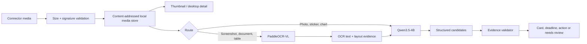

# Multimodal Image Design

Status: thumbnail, OCR/evidence, local model and audit tooling implemented in development build
`0.1.0.42`; real human review, field observation and production signing remain release gates.

## 1. Product outcome

SignalDesk must be able to show an image that a supported connector actually supplied, extract
visible text, understand the image in the surrounding conversation, and preserve enough evidence
for a user to verify every deadline or action. It must never imply that a LINE or Messenger
notification image was read when Windows exposed only the words "sent a photo".

Displaying, reading and understanding are separate capabilities:

| Capability | Responsibility | Requires a model |
|---|---|---|
| Display | Safe local storage, thumbnail, detail viewer | No |
| Exact text extraction | OCR text and layout regions | Yes, OCR |
| Semantic understanding | Summary, category, action/deadline candidates | Yes, VLM |
| Decision | Evidence validation and attention policy | Deterministic code |

## 2. Model decision

- Primary VLM: [`Qwen/Qwen3.5-4B`](https://huggingface.co/Qwen/Qwen3.5-4B).
- OCR/document parser: [`PaddlePaddle/PaddleOCR-VL-1.6`](https://huggingface.co/PaddlePaddle/PaddleOCR-VL-1.6).
- Compatibility fallback: [`Qwen/Qwen3-VL-4B-Instruct`](https://huggingface.co/Qwen/Qwen3-VL-4B-Instruct).
- `Qwen3-VL-8B-Instruct` is an audit candidate only. It is not the default on a 16 GB GPU.

The primary route is local and non-thinking. External inference remains disabled. Qwen runs on the
RTX 4080 SUPER; WinUI composition can remain on the AMD integrated GPU. OCR is loaded on demand and
does not run simultaneously unless measured VRAM headroom permits it.

## 3. Source capability matrix

| Source | Image bytes | Current/target behavior |
|---|---|---|
| Gmail API | Available for MIME attachments after explicit fetch | Download supported image parts, display, OCR/VLM |
| Messenger JSON/ZIP archive | Often available inside the export | Resolve safe archive-relative media paths and import |
| LINE TXT archive | Usually only an attachment marker | Show metadata-only state; never invent pixels |
| LINE personal notification | Usually text preview only | Show "image unavailable" when Windows exposes no bytes |
| Messenger personal notification | Usually text preview only | Same limitation; open source for the real image |
| LINE Official Account webhook | Image message ID is available | Fetch with official API only after connector setup |
| Messenger Page webhook | Attachment URL may be available | Fetch through the official Page integration only |

## 4. Data flow



The first implementation accepts at most eight media references per event and sends at most the
latest one to the always-on model route. Remaining assets stay available in message detail. This is
a latency/VRAM guard, not a permanent product limit.

## 5. Contracts and storage

`UnifiedEvent.media[]` contains only portable metadata:

```json
{
  "asset_id": "media_0123456789abcdef0123456789abcdef01234567",
  "kind": "screenshot",
  "mime_type": "image/png",
  "original_name": "schedule.png",
  "byte_size": 84312,
  "availability": "available",
  "sha256": "<64 lowercase hex characters>",
  "alt_text": null
}
```

No local filesystem path crosses the API. The SQLite `media_assets` and `event_media` tables bind a
content-addressed file to the exact event. The authenticated `GET /api/v1/media/{asset_id}` route is
the full-resolution UI read path. `GET /api/v1/media/{asset_id}/thumbnail` returns a bounded,
metadata-stripped first-frame PNG for Inbox and Glance.

`availability` is mandatory and honest:

- `available`: SignalDesk owns validated local bytes.
- `metadata_only`: the provider reported an image but supplied no bytes.
- `missing`: a previously referenced local/export file cannot be found.
- `blocked`: type, signature, size or security policy rejected the content.

## 6. Safe decoding policy

- Maximum original asset size: 20 MB.
- Initial allowlist: JPEG, PNG, WebP and GIF.
- File signatures must match the declared MIME type.
- SVG, HTML, executables and arbitrary archive members are never rendered as images.
- Original names are reduced to a basename; storage names derive from SHA-256.
- Animated images render a safe first-frame thumbnail by default.
- The VLM input path has a stricter 8 MB limit and a future decoded-pixel budget.
- EXIF and untrusted metadata are not included in the model prompt unless explicitly sanitized.

The implemented thumbnail worker enforces a 40-megapixel decoded ceiling, treats decompression-bomb
warnings as errors, normalizes EXIF orientation, strips metadata, and atomically writes a maximum
512 × 512 PNG. Out-of-process decoding remains optional defense-in-depth before public release.

## 7. OCR and evidence contract

The OCR service returns immutable analysis tied to `asset_id` and `sha256`:

```json
{
  "status": "completed",
  "asset_id": "media_...",
  "asset_sha256": "...",
  "ocr_model_id": "PaddlePaddle/PaddleOCR-VL-1.6",
  "ocr_model_revision": "pinned-before-release",
  "blocks": [
    {
      "block_id": "ocr_...",
      "text": "報名截止 8 月 10 日",
      "region": {"x": 0.12, "y": 0.40, "width": 0.70, "height": 0.11},
      "confidence": 0.94
    }
  ]
}
```

Qwen receives the image, the latest bounded message context and completed OCR blocks. A visual
action or deadline is accepted only when its `evidence_asset_id` belongs to the thread and its
`evidence_block_ids` resolve to localized OCR blocks tied to the same asset hash. Whole-image text
without coordinates cannot prove an exact deadline.
Object-only claims without OCR evidence may be summarized but cannot create an exact deadline. Low
confidence output becomes `needs_review` and retains `visual_evidence_unverified`.

## 8. Runtime budgets

| Route | Input budget | Output budget | Residency |
|---|---:|---:|---|
| Text triage | 384 input tokens | 128 tokens | always-on/auto-sleep |
| Visual triage | one resized image + 2K–4K text/visual context | 256 tokens | Qwen always-on or auto-sleep |
| OCR | one image/document page | structured blocks | on-demand |

The old global 512-token statement applies only to text triage. Images create visual tokens and must
use a separate pixel/context budget. Initial preprocessing targets a long edge around 1280 px and
must be tuned with measured small-text recall rather than assumed as a fixed release value.

## 9. Desktop UX

Inbox and Glance show a small thumbnail only when `availability=available`. Detail provides:

- the image at a bounded size with zoom/open controls;
- source, received time and availability label;
- OCR text with "copy" and optional highlighted evidence region;
- image summary and model/validator status;
- a visible limitation banner when only metadata exists;
- retry analysis and remove-local-copy controls.

If a LINE or Messenger Windows toast only says that an image/sticker was sent, Windows exposes no
media bytes to SignalDesk. The desktop card therefore renders an explicit `無預覽` state instead of
fabricating a thumbnail. Gmail MIME attachments and Messenger archive files that contain supported
image bytes follow the normal thumbnail and OCR path.

Image-only messages stay separated by conversation/sender exactly like text messages. They never
collapse into a generic LINE, Messenger, browser or Windows card.

## 10. Delivery phases and acceptance gates

### M1 — Foundation (implemented in this branch)

- Media schema and per-event association.
- Content-addressed safe local store.
- Authenticated local media read route.
- Privacy deletion covers media files and database rows.
- OpenAI-compatible and Transformers Qwen paths accept one image.
- Missing media remains explicit and testable.

### M2 — Connector acquisition (in progress)

- Gmail MIME image attachment fetch with size/type limits (implemented; live Windows verification pending).
- Messenger ZIP safe relative-path extraction (implemented; real-export matrix pending).
- Official webhook media fetch where configured.
- Retry/quarantine and connector capability UI.

### M3 — Desktop presentation (implemented; packaged verification pending)

- Safe thumbnail cache and WinUI Inbox/Glance image controls (implemented).
- Authenticated detail viewer and accessibility name (implemented); OCR/error/loading polish remains.
- Glance uses a compact thumbnail without increasing card height unpredictably.

### M4 — OCR/VLM evidence (implemented; runtime quality audit pending)

- On-demand local PaddleOCR-VL-1.6 Transformers service and versioned result schema.
- Qwen3.5-4B multimodal gateway plus a BF16/INT8/NF4 GPU benchmark command.
- Hash- and coordinate-bound OCR evidence validator.
- Persisted analysis API and automatic thread re-analysis after successful OCR.
- Revision pinning is supported; explicit OOM cancellation/residency tuning remains.

### M5 — Audit and release (tooling implemented; real gates not yet satisfied)

- A 300-item fictional image queue and SHA-256 manifest are committed; all are explicitly
  `unreviewed` until a person records a reviewer and timestamp.
- Separate screenshot, document, photo, sticker and missing-image slices.
- Zero fabricated exact deadlines in the locked release gate.
- Measure OCR character accuracy, evidence precision/recall, faithfulness, latency and peak VRAM.
- A content-free Shadow report enforces the real elapsed-time and user-label gates.
- Production release tooling refuses to sign unless the locked audit and Shadow gates pass.

## 11. Operator commands

```bash
SIGNALDESK_VISION_BACKEND=paddleocr-vl .venv/bin/signaldesk

.venv/bin/signaldesk-model-benchmark --family qwen --model Qwen/Qwen3.5-4B \
  --image benchmarks/multimodal/assets/mm-001.png --quantization bf16 \
  --output benchmarks/results/qwen-bf16.json

.venv/bin/signaldesk-multimodal-review status
.venv/bin/signaldesk-multimodal-review review --id mm-001 --decision approved \
  --reviewer "Reviewer name"

.venv/bin/signaldesk-shadow --database data/signaldesk.db start
.venv/bin/signaldesk-shadow --database data/signaldesk.db report --days 14 \
  --output runs/shadow-report.json
```

Windows GPU runtime installation (PowerShell 5.1 or newer):

```powershell
powershell -ExecutionPolicy Bypass -File .\scripts\setup-windows-model-runtime.ps1
```

The installed desktop launcher detects this private runtime, starts Qwen/PaddleOCR locally, and
falls back to the packaged deterministic service if the optional environment is damaged.

## 12. Definition of done

Image support is not complete merely because a thumbnail renders. It is complete only when supported
connectors acquire real bytes, every state is visible in WinUI, OCR/VLM output is hash-bound and
validated, privacy deletion removes derivatives, the locked audit passes, and the Windows installer
can reproduce the model/runtime setup without private files.
