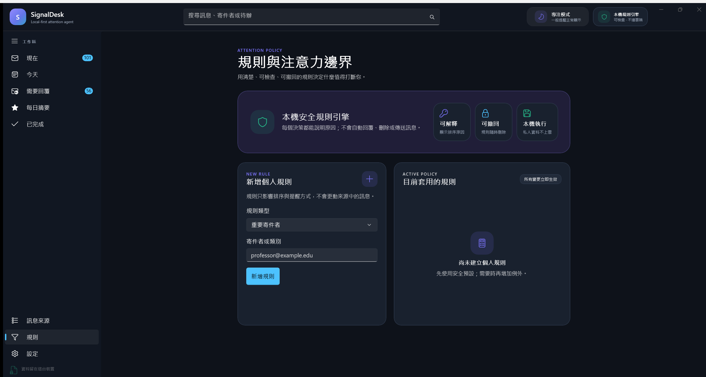
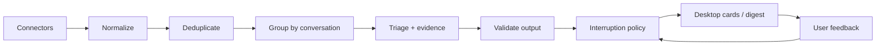
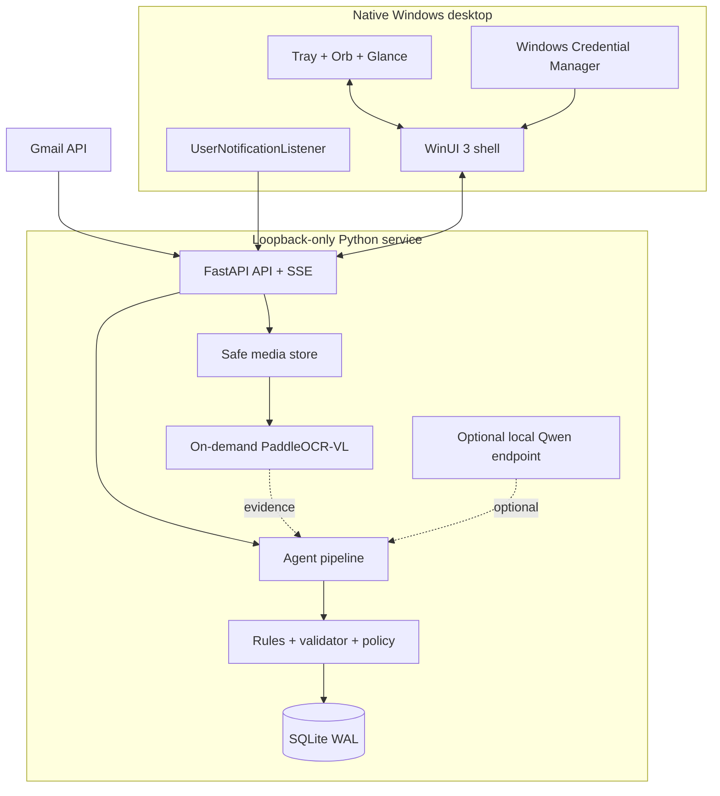

# SignalDesk

### A local-first Windows desktop agent for turning message overload into a calm, actionable inbox.

[](https://www.microsoft.com/windows/windows-11)
[](https://learn.microsoft.com/windows/apps/winui/winui3/)
[](https://www.python.org/)
[](https://github.com/hanklin9188/signaldesk-agent/actions/workflows/spec-validation.yml)
[](SECURITY_PRIVACY.md)
[](LICENSE)



SignalDesk is a native Windows 11 attention agent that unifies Gmail and visible Windows notification previews from LINE and Messenger. It groups messages by conversation, removes notification replays, extracts reply needs and deadlines, and applies an explainable interruption policy before anything reaches the user.

> 中文摘要：SignalDesk 是原生 Windows 桌面 Agent，將 Gmail、LINE 與 Messenger 的可用訊息整理成可處理的卡片；分類、摘要、規則與偏好都在本機完成，且沒有自動傳送訊息的路徑。

## What makes it an agent

SignalDesk is more than a notification viewer. Every incoming event passes through a bounded, auditable decision loop:



- Evidence-backed summaries: extracted actions and deadlines retain supporting spans.
- Deterministic safety baseline: malformed or unavailable model output falls back to local rules.
- Attention policy: quiet hours, focus mode, VIP/mute rules, uncertainty penalties, and an interruption budget.
- Human control: the app can open, snooze, mark done, create reminders, and prepare drafts—but never auto-sends.
- Local preference learning: feedback adjusts ranking without uploading private message text.
- Multimodal foundation: real connector-supplied image bytes are displayed directly; PaddleOCR-VL
  extracts localized text and Qwen turns verified message/image context into structured triage.

## Desktop experience

The production interface is a native WinUI 3 application, not a web wrapper.

| Surface | Purpose |
|---|---|
| Inbox Center | Search, source filters, priority filters, batch actions, and evidence-rich message detail |
| Glance | Always-on-top view of the latest useful items; refreshes every 30 seconds |
| Focus mode | Raises the real-time interruption threshold while keeping messages available in the inbox |
| Daily Digest | Groups urgent items, deadlines, replies, and lower-priority information |
| Source Center | Gmail OAuth health, Windows notification permission, and local chat archive imports |
| Attention Policy | Explainable VIP, priority, and mute rules that can be removed at any time |
| Privacy Controls | Local export, retention settings, preference reset, and confirmed private-data deletion |

Gmail, LINE, Messenger, and Windows notifications have distinct reusable source icons and color treatments across Inbox, Detail, Glance, Digest, and Source Center.

## Connector scope

| Source | Current integration | Completeness |
|---|---|---|
| Gmail | Official OAuth, initial sync, 60-second incremental sync, multiple accounts, transient transport retry and per-message failure isolation | Full message/thread content under granted scope |
| LINE personal | Official text archive import + Windows notification listener | Notification preview for new inbound messages |
| Messenger personal | Accounts Center JSON/ZIP import + Windows/browser notification listener | Notification preview for new inbound messages |
| LINE Official Account | Signed webhook connector | Full webhook payload for the configured official account |
| Messenger Page | Signed Meta webhook connector | Full webhook payload for the configured Page |

Personal LINE and Messenger accounts do not expose a supported API for full private-chat synchronization. SignalDesk does not scrape UI, reverse-engineer chat databases, or steal sessions. When Windows only exposes a preview, the UI says so explicitly.

Models do not acquire messages or images. Gmail supplies real attachment bytes and therefore already
supports thumbnails. A personal LINE/Messenger toast that contains only “sent a photo” supplies no
pixels for any model to read. Direct personal-chat images require a separate opt-in acquisition
connector (Messenger Web companion; LINE foreground/manual companion), not a larger model.

## Architecture



The native shell launches the packaged Python service on `127.0.0.1`, retrieves a random bearer token from Windows Credential Manager, and communicates only through the authenticated loopback API. See [architecture details](ARCHITECTURE.md) and the [code ownership map](docs/PROJECT_STRUCTURE.md).

The image/OCR/Qwen delivery contract, supported-source limits and acceptance gates are documented in
[Multimodal Image Design](MULTIMODAL_DESIGN.md). A notification saying "sent a photo" is not treated
as image access.

## Run the project

### Windows desktop build

Prerequisites: Windows 11, Python 3.12, .NET 8 SDK, and Visual Studio 2022 with the .NET desktop/Windows App SDK workload.

```powershell
git clone https://github.com/hanklin9188/signaldesk-agent.git
cd signaldesk-agent
powershell -ExecutionPolicy Bypass -File .\scripts\setup-windows-prerequisites.ps1 -Install
.\scripts\build-windows.ps1 -Configuration Release
```

The signed-development MSIX workflow and Gmail OAuth setup are documented in [WINDOWS_GMAIL_SETUP.md](WINDOWS_GMAIL_SETUP.md). Development certificates and OAuth credentials are intentionally excluded from the repository.

### Service development

```bash
python3.12 -m venv .venv
.venv/bin/pip install -e '.[dev,gmail]'
SIGNALDESK_DEMO=1 .venv/bin/signaldesk
```

`SIGNALDESK_DEMO=1` seeds only fictional data into an empty development database. The browser surface at `http://127.0.0.1:8765` is a diagnostic fallback; the portfolio product is the native desktop app.

## Quality gates

```bash
.venv/bin/ruff check signaldesk tests
.venv/bin/pytest
.venv/bin/signaldesk-benchmark --output runs/verification
```

Current local verification:

- 70 automated tests passing.
- 300 synthetic locked scenarios / 1,800 checks passing.
- RTX 4080 SUPER image smoke: Qwen3.5-4B BF16/NF4/INT8 and PaddleOCR-VL-1.6 BF16 all loaded
  locally and found the fictional visible deadline; see [raw metrics](benchmarks/results/README.md).
- Zero unauthorized actions and zero auto-send paths.
- Native WinUI build: 0 compile errors.
- MSIX installed and exercised on Windows 11.

The optional Windows GPU runtime is reproducible with
`scripts/setup-windows-model-runtime.ps1`. It pins Qwen3.5-4B and PaddleOCR-VL-1.6 revisions,
keeps inference local, and performs model work after the deterministic card is already visible.
Qwen uses NF4 4-bit weights by default. Thumbnails require no model; after the user selects
“分析圖片”, PaddleOCR extracts evidence and releases before Qwen interprets the photo or document.
Neither model remains resident on the GPU. A
fictional end-to-end RTX 4080 SUPER run measured 3.277 GiB peak allocated VRAM and 0.008 GiB after
Qwen release.

Qwen summaries use a strict zh-TW contract: conclusion first, then the supported actor, event,
next step and deadline. One in-memory repair pass corrects malformed/truncated JSON without loading
a second model copy. Message detail identifies whether the visible result is a validated Qwen
summary or the deterministic fast fallback.

CI repeats schema parsing, lint, tests, a benchmark smoke gate, and the Windows native build.

## Repository map

```text
native/SignalDesk.Shell/   Native WinUI 3 desktop application
signaldesk/                Local agent service and decision pipeline
signaldesk/connectors/     Gmail and archive connectors
schemas/                   Versioned event and agent-output contracts
tests/                     API, pipeline, archive, privacy, and safety tests
benchmarks/                Locked fictional evaluation scenarios
scripts/                   Setup, build, verification, and packaging tools
docs/                      Portfolio architecture and ownership documentation
```

For module-by-module responsibilities, start with [Project Structure & Code Ownership](docs/PROJECT_STRUCTURE.md). For current implementation status and honest limitations, see [IMPLEMENTATION_STATUS.md](IMPLEMENTATION_STATUS.md).

## Privacy and safety invariants

- Private message text is treated as untrusted data, never as tool instructions.
- The API binds to loopback and requires an unguessable token.
- OAuth tokens live in the OS credential store, not SQLite or Git.
- Source URLs must match connector-specific HTTPS allowlists.
- Notification previews remain labeled incomplete; image/sticker content is never guessed.
- Media paths never cross the API; supported bytes use content-addressed local storage and are
  removed by confirmed private-data deletion.
- There is no endpoint for automatic sending, source deletion, or arbitrary shell execution.

Security design: [SECURITY_PRIVACY.md](SECURITY_PRIVACY.md) · Responsible disclosure: [SECURITY.md](SECURITY.md)

## Roadmap

- Expand anonymized, human-labeled evaluation beyond synthetic scenarios.
- Complete 7–14 day Shadow Mode calibration studies.
- Add production publisher signing and a stable Windows release channel.
- Audit optional local Qwen inference against the deterministic baseline before considering training.
- Human-review the prepared 300-item multimodal audit and complete real PaddleOCR/Qwen quality runs.

## License

[MIT](LICENSE) © Hank Lin
