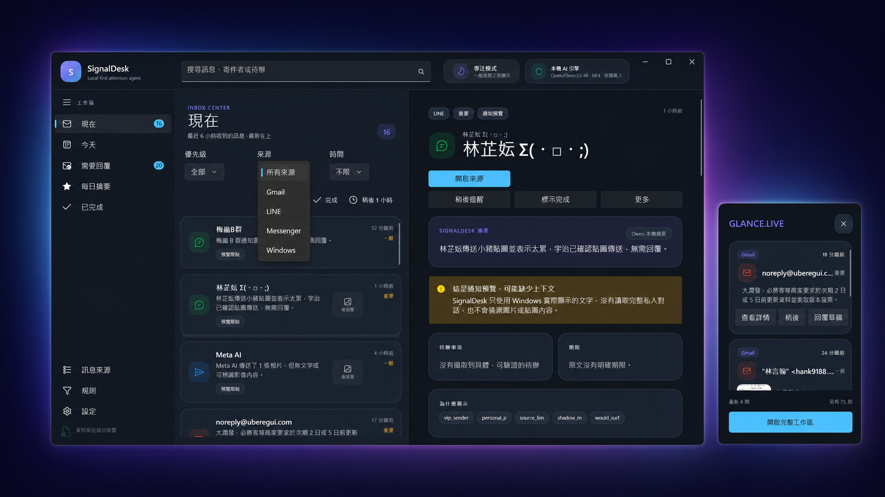
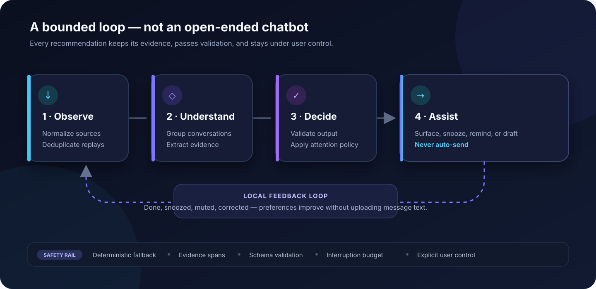
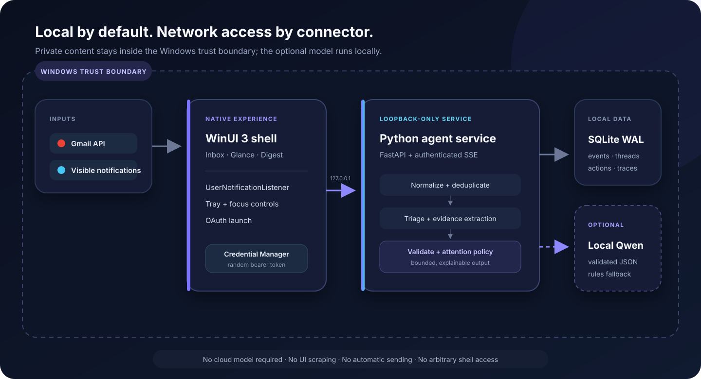

<div align="center">

# SignalDesk

### A local-first Windows agent that turns message overload into a calm, actionable inbox.

<p>
  <a href="https://www.microsoft.com/windows/windows-11"></a>
  <a href="https://learn.microsoft.com/windows/apps/winui/winui3/"></a>
  <a href="https://www.python.org/"></a>
  <a href="https://github.com/hanklin9188/signaldesk-agent/actions/workflows/spec-validation.yml"></a>
  <a href="SECURITY_PRIVACY.md"></a>
  <a href="LICENSE"></a>
</p>



<p>
  SignalDesk brings Gmail and visible Windows notification previews from LINE and Messenger into one native desktop workspace. It groups conversations, removes notification replays, finds reply needs and deadlines, then decides what deserves your attention — without sending private message text to a cloud model.
</p>

<p>
  <a href="#quick-start"><strong>Quick start</strong></a> ·
  <a href="#what-makes-it-an-agent"><strong>How the agent works</strong></a> ·
  <a href="#architecture"><strong>Architecture</strong></a> ·
  <a href="IMPLEMENTATION_STATUS.md"><strong>Implementation status</strong></a>
</p>

</div>

---

## Why SignalDesk?

Most inboxes optimize for arrival. SignalDesk optimizes for attention: what needs a reply, what has a deadline, what can wait, and why.

<table>
  <tr>
    <td width="33%" valign="top">
      <h3>One calm inbox</h3>
      <p>Gmail, LINE, Messenger, and Windows notification previews become consistent conversation cards instead of separate streams.</p>
    </td>
    <td width="33%" valign="top">
      <h3>Explainable priorities</h3>
      <p>Every action and deadline keeps its supporting evidence. Uncertainty is shown instead of hidden or guessed away.</p>
    </td>
    <td width="33%" valign="top">
      <h3>Private by design</h3>
      <p>Processing and preference learning stay local. The optional Qwen model runs on-device and always has a deterministic fallback.</p>
    </td>
  </tr>
</table>

> [!NOTE]
> Personal LINE and Messenger accounts do not provide a supported API for complete private-chat synchronization. SignalDesk uses official archives for history and only the notification previews Windows makes visible for new messages. It never scrapes the UI, reverse-engineers chat databases, or steals sessions.

## What makes it an agent

SignalDesk does more than collect notifications. Every incoming event moves through a **bounded, auditable decision loop** that observes, understands, decides, and assists — then learns only from explicit local feedback.



<table>
  <tr>
    <td width="50%" valign="top">
      <h3>Evidence before inference</h3>
      <p>Extracted actions and deadlines retain the source spans that support them, so the interface can show why an item was prioritized.</p>
    </td>
    <td width="50%" valign="top">
      <h3>Safe when models fail</h3>
      <p>Malformed, uncertain, or unavailable model output is rejected. Local rules provide a deterministic baseline instead.</p>
    </td>
  </tr>
  <tr>
    <td width="50%" valign="top">
      <h3>Attention is a policy</h3>
      <p>Quiet hours, Focus mode, VIP and mute rules, uncertainty penalties, and an interruption budget determine what may surface.</p>
    </td>
    <td width="50%" valign="top">
      <h3>The user stays in control</h3>
      <p>SignalDesk can open, snooze, mark done, create a reminder, or prepare an editable draft. There is no automatic-send path.</p>
    </td>
  </tr>
</table>

## Desktop experience

The production interface is a native **WinUI 3** application — not a web wrapper.

| Surface | What it helps you do |
| :--- | :--- |
| **Inbox Center** | Search, filter by source or priority, take batch actions, and inspect evidence-rich message details. |
| **Glance** | Keep the latest useful items in a compact always-on-top window that refreshes every 30 seconds. |
| **Focus mode** | Raise the real-time interruption threshold without hiding anything from the inbox. |
| **Daily Digest** | Review urgent items, deadlines, reply needs, and lower-priority information in clear groups. |
| **Source Center** | Check Gmail OAuth health, Windows notification access, and local chat-archive imports. |
| **Attention Policy** | Create and remove explainable VIP, priority, and mute rules. |
| **Privacy Controls** | Export local data, set retention, reset preferences, and confirm private-data deletion. |

## Connector coverage

SignalDesk labels the completeness of every source instead of implying access it does not have.

| Source | Integration | Content available |
| :--- | :--- | :--- |
| **Gmail** | Official OAuth, initial sync, 60-second incremental sync, multiple accounts | Full message and thread content under the granted scope |
| **LINE personal** | Official text-archive import + Windows notification listener | Archive history; notification preview for new inbound messages |
| **Messenger personal** | Accounts Center JSON/ZIP import + Windows/browser notification listener | Archive history; notification preview for new inbound messages |
| **LINE Official Account** | Signed webhook connector | Full webhook payload for the configured official account |
| **Messenger Page** | Signed Meta webhook connector | Full webhook payload for the configured Page |

When Windows exposes only a preview, the UI marks it as incomplete. Missing images, stickers, or conversation context are never invented.

## Architecture

SignalDesk separates the native interface from the local decision service. They communicate through an authenticated loopback API; credentials stay in Windows Credential Manager and private data stays in the local SQLite store.



<table>
  <tr>
    <td width="33%" valign="top">
      <h3>Native Windows boundary</h3>
      <p>The WinUI shell owns the inbox, Glance, tray, Focus controls, OAuth launch, and <code>UserNotificationListener</code>.</p>
    </td>
    <td width="33%" valign="top">
      <h3>Authenticated loopback</h3>
      <p>The shell launches the packaged Python service on <code>127.0.0.1</code> and authenticates with a random bearer token.</p>
    </td>
    <td width="33%" valign="top">
      <h3>Optional local inference</h3>
      <p>Qwen can assist the pipeline on-device. Its JSON must validate; otherwise deterministic rules take over.</p>
    </td>
  </tr>
</table>

For deeper technical context, read the [architecture details](ARCHITECTURE.md) and [code ownership map](docs/PROJECT_STRUCTURE.md).

## Quick start

### Windows desktop build

**Prerequisites:** Windows 11, Python 3.12, .NET 8 SDK, and Visual Studio 2022 with the .NET desktop / Windows App SDK workload.

```powershell
git clone https://github.com/hanklin9188/signaldesk-agent.git
cd signaldesk-agent
powershell -ExecutionPolicy Bypass -File .\scripts\setup-windows-prerequisites.ps1 -Install
.\scripts\build-windows.ps1 -Configuration Release
```

The signed-development MSIX workflow and Gmail OAuth setup are documented in [WINDOWS_GMAIL_SETUP.md](WINDOWS_GMAIL_SETUP.md). Development certificates and OAuth credentials are intentionally excluded from the repository.

<details>
<summary><strong>Service-only development</strong></summary>

```bash
python3.12 -m venv .venv
.venv/bin/pip install -e '.[dev,gmail]'
SIGNALDESK_DEMO=1 .venv/bin/signaldesk
```

`SIGNALDESK_DEMO=1` seeds only fictional data into an empty development database. The browser surface at `http://127.0.0.1:8765` is a diagnostic fallback; the portfolio product is the native desktop app.

</details>

## Quality and safety

Current local verification:

| Gate | Result |
| :--- | :--- |
| Automated tests | **41 passing** |
| Locked benchmark | **300 scenarios / 1,800 checks passing** |
| Unauthorized actions | **0** |
| Auto-send paths | **0** |
| Native WinUI build | **0 compile errors** |
| Windows packaging | MSIX installed and exercised on Windows 11 |

Run the same core checks locally:

```bash
.venv/bin/ruff check signaldesk tests
.venv/bin/pytest
.venv/bin/signaldesk-benchmark --output runs/verification
```

The safety invariants are deliberately narrow:

- Private message text is untrusted data, never a tool instruction.
- The API binds to loopback and requires an unguessable token.
- OAuth tokens live in the OS credential store, not SQLite or Git.
- Source URLs must match connector-specific HTTPS allowlists.
- Notification previews stay labeled incomplete; missing media is never guessed.
- There is no endpoint for automatic sending, source deletion, or arbitrary shell execution.

Read the full [privacy and security design](SECURITY_PRIVACY.md) or [report a vulnerability](SECURITY.md).

## Repository map

```text
native/SignalDesk.Shell/   Native WinUI 3 desktop application
signaldesk/                Local agent service and decision pipeline
signaldesk/connectors/     Gmail, webhook, notification, and archive connectors
schemas/                   Versioned event and agent-output contracts
tests/                     API, pipeline, archive, privacy, and safety tests
benchmarks/                Locked fictional evaluation scenarios
scripts/                   Setup, build, verification, and packaging tools
docs/                      Architecture, UX, and code-ownership documentation
```

### Project documentation

| Start here | Reference |
| :--- | :--- |
| [Implementation status](IMPLEMENTATION_STATUS.md) | Verified features, deliberate boundaries, and remaining release gates |
| [Project structure](docs/PROJECT_STRUCTURE.md) | Module-by-module responsibilities and ownership |
| [Connector guide](CONNECTORS.md) | Supported sources, setup, and completeness limits |
| [Design specification](DESIGN.md) | Product behavior and system design |
| [Validation](VALIDATION.md) | Test strategy, benchmarks, and quality gates |
| [Contributing](CONTRIBUTING.md) | Development workflow and contribution guidance |

## Roadmap

- Expand anonymized, human-labeled evaluation beyond synthetic scenarios.
- Complete a 7–14 day Shadow Mode calibration study.
- Add production publisher signing and a stable Windows release channel.
- Audit optional local Qwen inference against the deterministic baseline before enabling it by default.

## License

Released under the [MIT License](LICENSE). © Hank Lin.
